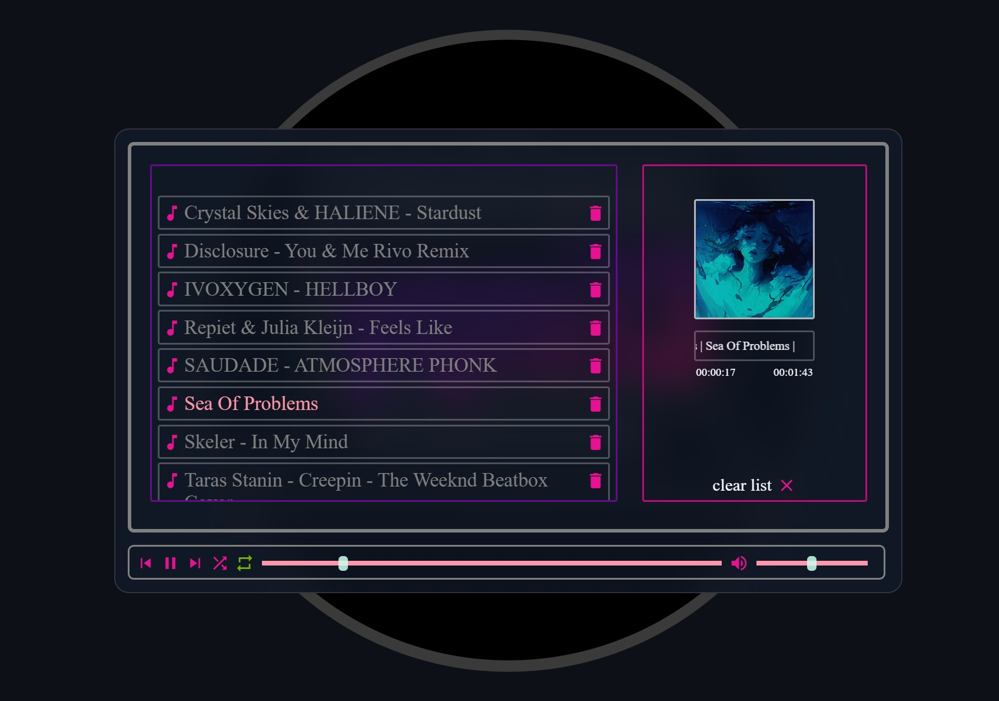
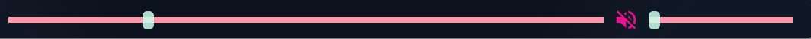
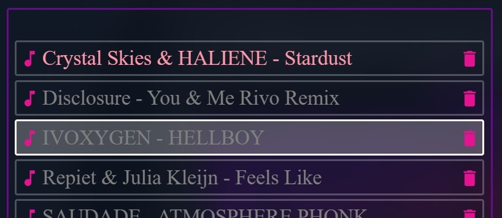
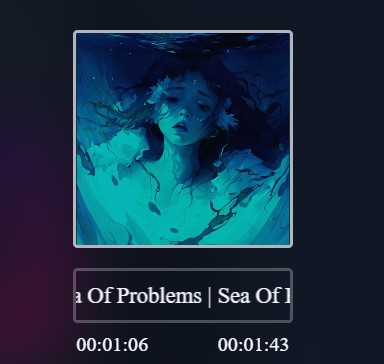
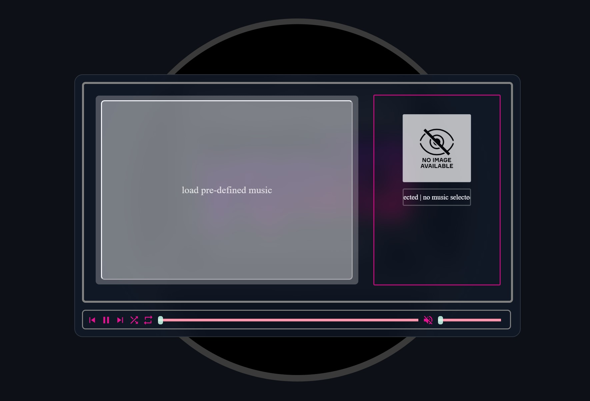

# yqni13 music player
version 1.0

## Screenshot - loaded

### Technology 

    
    
    
    Google Fonts

 

TRY IT: https://github.com/yqni13/WEB_music/
  

## Functionality

### Modes

    <li>
        repeat (playlist continues to play in loop [green button])
    </li>
    <li>
        shuffle (playlist plays random chosen songs [blue button])
    </li>

### Defaults

    As the music player is started, no music is loaded, as the first idea was to take music elements as an input from the user and play them. Therefore, the input field "load pre-defined music" is shown. Currently, the player loads a pre-defined list of songs and thumbnail images by clicking on the input field, referring to content inside path "./assets/demo-music" and "./assets/demo-thumbnail".  
    Default song: first in list 
    Default volume: 50% 
    Default progress: 0% 
    Default mode: repeat

### Sliders

    The progress bar [left] and volume bar [right] take input by moving the slider button to adjust values [time/volume].

### Others

    Play or Pause button hide/appear depending on actively playing a song. The skip buttons to previous or next song work in both modes (shuffle/repeat). A song from the list can be pre-selected with normal onclick, which marks the song, but doesn't start it to play. A song is finally selected and start to play by dblclick on wanted element.

 

    After a song is selected and starts to play, the regarding thumbnail will be shown in the detail section. Additionally, the title of the song will rotate endlessly and the current time progress as well as the total duration are shown below.

## Screenshot - cleared

    Meanwhile the first idea was to enable the user to select music from local storage via audio input in html, this feature was dismissed. Javascript doesn't allow on client side to access user directories. This is only possible from server side to access and would exceed the scope of this side project. Therefore, this music player as well as seen in many other repositories, this music player will use pre-defined music elements.

## Updates

### Aimed objectives for next updates within vers1.0:

    - error handling for music failed to load 
    - error handling for thumbnails failed to load 
    - adding author to displayed information 
    - deactivate tools if no music is loaded  

### Aimed objectives for next update within vers2.0:

    - load music from specified path (no more static data) 
    - load thumbnails from music element 

