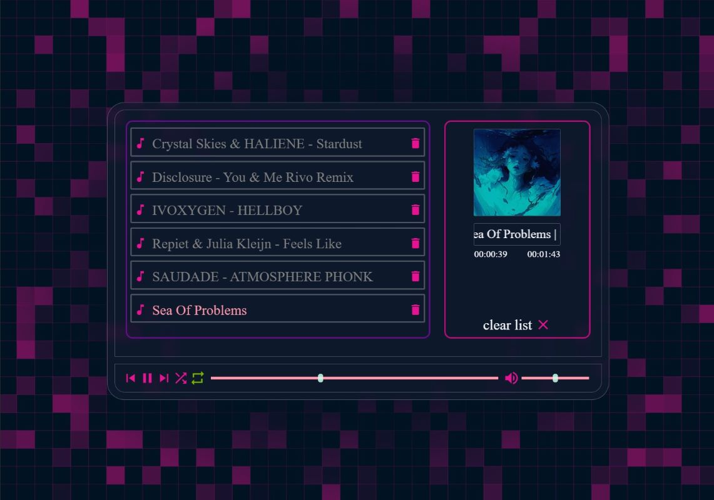
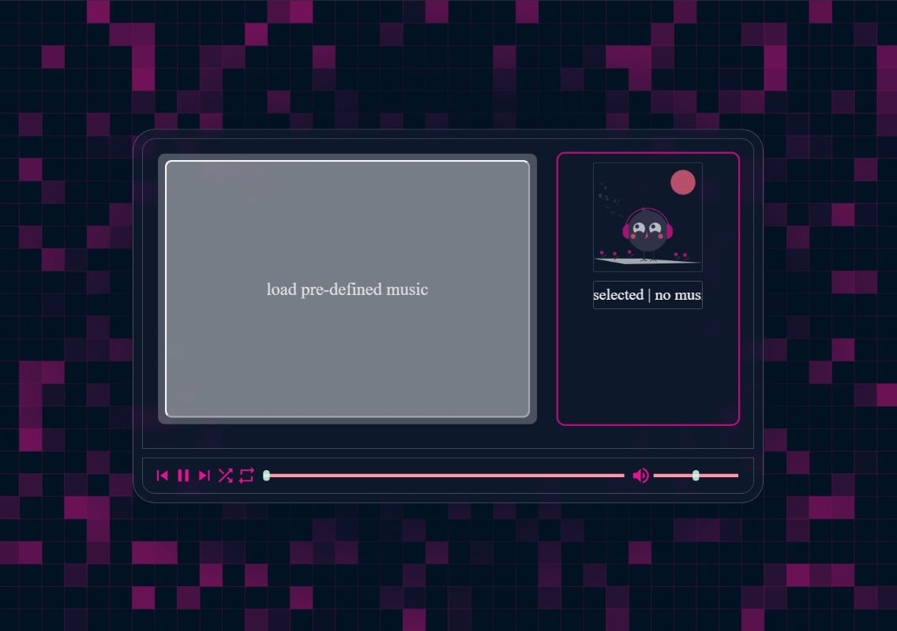
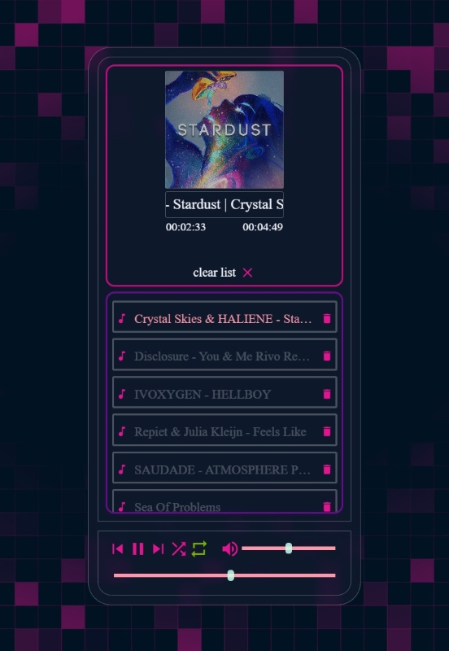

# yqni13 WEB_music
$\texttt{\color{teal}{v1.5.0}}$

 

    

### Technology 

    
    
    
    Google Fonts

### <a href="https://yqni13.github.io/WEB_music/">TRY LIVE DEMO</a>

 

## HOW TO:

1. Start this single page application by opening index.html in your browser.
2. Click on "load pre-defined music" and the default music is listed on the left side as single song elements.
3. The first song automatically starts to play. For default the repeat mode will play song after song in order and start with 50% volume.
4. Press pause to stop the music, keep playing or select another song by the skip buttons (previous/next) or via double click on the song element in interest.
5. Use the volume slider to increase/decrease the volume or the progress slider to navigate to your prefered time spot of a song.
6. Currently single song elements can not be removed but only the complete list with the "clear list x" button, which removes the whole list and the "load pre-defined music" field re-appears.

 

## Features

### Modes

1. repeat playlist continues to play in loop ( ${\textsf{\color{yellowgreen}green}}$ button )

    
    

2. shuffle playlist plays random chosen songs ( ${\textsf{\color{skyblue}blue}}$ button )

### Defaults

As the music player is started, no music is loaded, as the first idea was to take music elements as an input from the user and play them. Therefore, the input field "load pre-defined music" is shown. Currently, the player loads a pre-defined list of songs and thumbnail images by clicking on the input field, referring to content inside path "./assets/demo-music" and "./assets/demo-thumbnail".  
Default song: first in list 
Default volume: 50% 
Default progress: 0% 
Default mode: ${\textsf{\color{yellowgreen}repeat}}$

### Sliders

    The progress bar [left] and volume bar [right] take input by moving the slider button to adjust values [time/volume].

### Others

Play or Pause button hide/appear depending on actively playing a song. The skip buttons to previous or next song work in both modes (shuffle/repeat). A song from the list can be pre-selected with normal ${\color{gray}onclick}$, which marks the song, but doesn't start it to play. A song is finally selected and start to play by ${\color{pink}dblclick}$ on wanted element.

 

    After a song is selected and starts to play, the regarding thumbnail will be shown in the detail section. Additionally, the title of the song will rotate endlessly and the current time progress as well as the total duration are shown below.

## Screenshot - cleared

    Meanwhile the first idea was to enable the user to select music from local storage via audio input in html, this feature was dismissed. Javascript doesn't allow on client side to access user directories. This is only possible from server side to access and would exceed the scope of this side project. Therefore, this music player as well as seen in many other repositories, this music player will use pre-defined music elements.

  

## Responsive design

    

    New scaling for resolution 300px > width > 1440px in 8 different steps in combination with flexbox styling ensures a responsive design to use on every device. Starting with v1.4.0 there are two modes. Firstly, the basic landscape mode for tablets and desktop devices to offer a higher screenwidth. Secondly, a new portrait oriented design offers a better handling for smaller devices or window sizes.

 

## Testing

### Cross-browser testing

 |  |  |  |  | 
|:------:|:------:|:------:|:------:|:------:|:------:|
|Firefox | Chrome | Opera  | Edge   | DuckGo | Brave  |
|Yes     | Yes    | Yes    | Yes    | Yes    | Yes    |

 

## Updates

[list of all updates](docs/update_protocol.md)
### $\textsf{last\ update\ 1.1.3\ >>\ {\color{pink}1.5.0}}$

- $\textsf{\color{green}Change:}$ Adapted all border radius regarding additional margin/padding/width.
- $\textsf{\color{green}Change:}$ Added new background.
- $\textsf{\color{green}Change:}$ Added responsive design.
- $\textsf{\color{green}Change:}$ Added new placeholder thumbnail and more consistent coloring.

 

### Aimed objectives for next $\textsf{\color{green}minor}$ update:
<dl>
    <dd>- error handling for music failing to load</dd>
    <dd>- error handling for thumbnails failing to load</dd>
    <dd>- enable removing single songs from list via trashbin icon</dd>
    <dd>- deploy a Web Application Manifest to make application a progressive web app (PWA) </dd>
</dl>

 

### Aimed objectives for next $\textsf{\color{cyan}major}$ update:
<dl>
    <dd>- load music from specified path (no more static data)</dd>
    <dd>- load metadata from music element and dispay (thumbnail, autor, genre, ...)</dd>
</dl>
